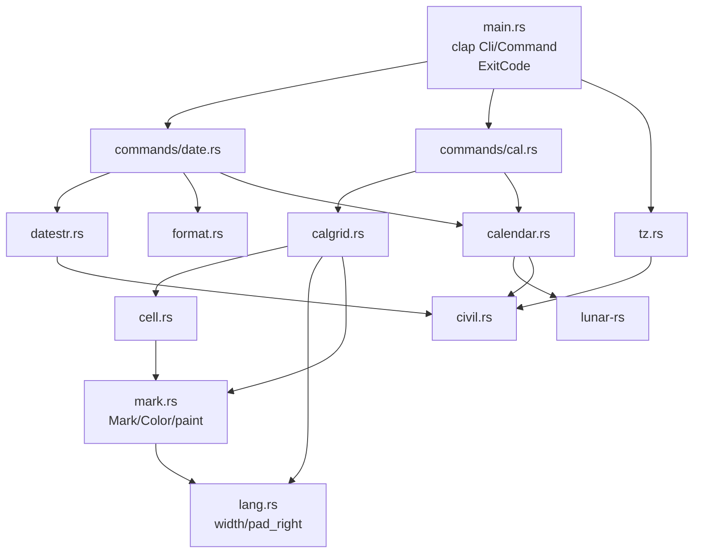

# Repository Guidelines

## Goal

`lunar` is a thin command-line wrapper around the
[`lunar-rs`](https://crates.io/crates/lunar-rs) 寿星天文历 engine. It exists to
display, query and convert the Chinese lunisolar calendar, through two
subcommands modelled on the Unix tools they are named after:

- **`lunar date`** — one day's almanac (公历 / 星期 / 农历 / 干支 / 生肖 / 节气 /
  法定), with `date(1)`-style input (`-d`) and a `-f` format engine;
- **`lunar cal`** — `cal(1)`-style month and year grids overlaid with lunar days,
  solar terms, festivals and the statutory calendar, over civil months or, with
  `-L`, lunar months.

**This repository never implements calendar arithmetic.** It parses arguments,
shapes `lunar-rs` output and lays out grids. That is the whole job. When the
engine and this tool disagree, the engine is right; when the engine lacks
something, fix it upstream, not here.

Non-goals: a library crate, a clock or time-of-day, a language layer, async,
weekday-derived holiday guesses. Do not add one without being asked.

Behaviour that differs from `cal(1)` / `date(1)` is a bug with a plan, not a
feature: the open ones live in [`docs/plans`](docs/plans).

## Dependency First

The upstream checkout is at `~/projects/lunar-rs` — read it before writing code
that answers a calendar question. `Solar` exposes ~144 public methods and `Lunar`
~305 across roughly thirty calendar systems; the odds that the question is
already answered are high.

| To find | Look in |
|---|---|
| A date conversion or attribute | `src/solar.rs`, `src/lunar.rs` — `grep 'pub fn'` |
| Name tables (weekday, month, day, ganzhi, zodiac) | `src/solar_util.rs`, `src/lunar_util/tables.rs` |
| Festivals and solar terms | `src/festival.rs`, `src/lunar_util/maps.rs`, `src/solar_util.rs` |
| Other calendar systems | `src/<system>.rs`, re-exported from `src/lib.rs` |
| The astronomy | `src/shou_xing/` |
| The statutory table (放假 / 调休) | `src/holiday_util.rs`, `src/holiday.rs`, `src/holiday_data.rs` — `Solar::get_legal_holiday` |

Two consequences:

1. **Add to `src/calendar.rs`, not to the command modules.** It is the single
   boundary to the engine and every wrapper in it is a one-line forward. A second
   path to `lunar-rs` is a design regression.
2. **Adapt quirks in the wrapper that owns them.** `solar()` maps the engine's
   `GregorianGap` to a range error; `solar_from_lunar` round-trips across the
   lunar/civil year mismatch. A wrapper that stops changing anything is dead
   weight — delete it.

Traps that have already cost this project a defect, and the reason each is now
written down:

- **Festivals come from three sources, and all three are needed.**
  `Solar::festivals()` (civil: 国庆节, 劳动节, weekday-floating ones),
  `Lunar::festivals()` (春节, 中秋节) and the **typed** `LunarFestival::from_ymd`,
  which alone knows 清明节, 上巳节, 中元节 and 冬至节. `calendar::traditional_festivals`
  chains them; `festival_rank` prefers the name a reader scans for. A name in
  `PRINCIPAL` that is not spelled as the engine spells it (`清明节`, not `清明`)
  sorts last and loses.
- **A lunar year and a civil year do not line up.** 腊月 always begins in the
  following January, so 农历 2026 年腊月初一 is 公历 2027-01-08. Lunar→civil must
  go through `calendar::solar_from_lunar`, which validates by whole-triple round
  trip; comparing civil years refuses 336,947 days and makes 腊月 unreachable.
- **Leap months are negative numbers** (`-4` = 闰四月). `calendar::m_abs` renders
  them and is also fed user input by error paths, so it range-checks before
  indexing the month table.
- **A 5-digit year is not a range error**: `date -d 10000-01-01` falls out of the
  grammar as unparsable, while `cal 10000` fails the range check. Both are
  correct; do not "fix" one into the other.

## Architecture & Data Flow

There is no `lib.rs` — everything is binary-internal, declared in `src/main.rs`.
Each module has one job and the dependency direction is one-way:



| Path | Role |
|---|---|
| `src/calendar.rs` | the only `lunar-rs` boundary: `CalError`, `MIN_YEAR`/`MAX_YEAR`, one-line wrappers |
| `src/civil.rs` | proleptic-Gregorian epoch ↔ civil bridge (Hinnant), `CivilDate` stepping; the engine models the 1582 reform and refuses 1582-10-05..=14, which the parser and grids must cross |
| `src/calgrid.rs` | grid layout: `Entry`/`Grid`, `GUTTER`, pitch, `render`; each cell carries its `Mark` |
| `src/cell.rs` | cell content priority, `CellStyle` |
| `src/datestr.rs` | the `-d` grammar |
| `src/format.rs` | the `-f` token engine |
| `src/lang.rs` | display-width measurement and `pad_right` |
| `src/mark.rs` | `Mark`, `Color`, `paint` — the only place SGR is written |
| `src/commands/` | the two subcommand implementations |
| `src/tz.rs` | local "today" from `TZ` / the system zone |

**Data flow.** `main()` parses clap, prints `--help-format` early if asked,
resolves `today` once via `tz::today()`, builds one `String`, dispatches to
`date::run` / `cal::run`, and writes the buffer once. On `Err` it prints
`lunar: {error}` to stderr, returns `ExitCode::FAILURE`, and **discards the
buffer** — a mid-loop failure in `cal` prints nothing on stdout.

Both commands share the signature:

```rust
pub fn run(args: &XArgs, today: CivilDate, out: &mut String) -> Result<(), CalError>
```

Command modules must never print. They append to `out` and return an error.

Invariants, in the order they are easiest to break:

- **`calendar.rs` is the only path to `lunar-rs` for calendar answers.** New
  wrappers go there, and they either shape output or adapt a quirk.
- **The two injection points are `today: CivilDate` and the `CellStyle` value
  struct.** Flags are mapped to `CellStyle` in exactly one place, `cal::run`. The
  `Color` mode is resolved in `main` and passed beside `today`; no module reads
  global state.
- **Cell priority is policy, not configuration.** `cell::content` is the single
  source of truth: `节日 > 初一显示月份名 > 节气 > 农历日`. The month-name level
  is skipped on 正月 so 春节 keeps its festival label; `--number` only affects
  the final level. Do not reorder or reimplement it elsewhere.
- **The statutory calendar is a mark, not a label.** 放假 and 调休 are painted
  (`mark::paint`), never written into the cell: a label there would displace the
  festival name or lunar day, which are the facts the tool exists to print. The
  cost is stated plainly: a piped grid shows no mark; `--color=always` is the way
  out, and `lunar date` reports the statutory calendar in words.
- **The two marks compose; neither wins.** `Mark::sgr` joins the parameters into
  one run — a 放假 reference day is `\x1b[31;7m`. Padding goes *inside* the SGR
  run, so a colourless and a coloured grid differ in trailing spaces only.
- **Grid width is display width**, measured by `lang::width` (CJK counts 2).
  Rust's `{:>width$}` counts characters and would misalign every CJK cell.
  `GUTTER` must stay: a cell that exactly fills its column would otherwise run
  into its neighbour (`5/235/24…`).
- **Only the days the month has are drawn.** Civil months enumerate
  `CivilDate::nth_existing_day`; lunar months ask the engine
  (`calendar::lunar_month_days`). Never step a month locally with `add_days` —
  the engine's calendar skips the ten reform days and uses the Julian leap rule
  before 1600, so local stepping drifts and walks into the gap.

## Conventions

- **Comments.** Module / function / struct docs are English prose; every `pub`
  item carries one. They describe what the code *is*: no history, no "used to",
  no strikethrough. All user-facing strings are Chinese, including errors and
  clap help. Do not add Chinese prose to doc-comments.
- **Errors.** One type, `CalError` (`src/calendar.rs`), with a hand-written
  Chinese `Display` using full-width punctuation, and `impl std::error::Error`.
  Every fallible path returns `Result<_, CalError>`; no `unwrap`/`expect` in
  `src/` (tests only). Helper constructors: `check_year`, `check_month`,
  `check_day`, `check_lunar_month`, `solar`, `solar_from_lunar`.
  `tests/documented_examples.rs` substring-matches the messages — **changing an
  error message is a suite change, in the same commit.**
- **Rendering.** Build into `&mut String` with `std::fmt::Write`
  (`let _ = write!(out, …)`), never `println!` — except the `--help-format`
  short-circuit. The `let _ =` is deliberate: a `String` cannot fail.
- **Formatting.** Plain rustfmt defaults; no config file. One import per line,
  no glob imports, std / external / `crate::` groups separated by blank lines.
- **No async.** Nothing to await; keep it synchronous.

## Command Surface Contracts

- **`-d` is 公历, `-l` is 农历, and the two differ in nothing else.** Both
  channels go through `datestr` — a `-d` string and a single positional through
  `parse`, the three positionals through `from_parts` — so a form one channel
  accepts the other must accept too, with the same failure. This invariant has
  broken before (`-l` re-reading only the positionals); it is pinned by
  `the_two_channels_differ_only_in_the_calendar_they_read`.
- **Adding a `-d` form:** extend `parse`'s precedence chain — keyword → `@epoch`
  → absolute → weekday → relative, first match wins. A new *absolute* shape must
  go through `Parts` + `resolve`; calling `calendar::solar` directly makes it
  civil-only. Relative units live in `apply_unit`; sub-day units are **refused**
  (`CalError::SubDayUnit`), not ignored.
- **What `-l` must not change:** keyword, `@epoch`, weekday and relative forms
  name a *day*, so they resolve against the reference exactly as before. A
  time-of-day suffix is civil-only and is refused under `-l` rather than dropped.
- **Adding a `-f` token:** extend the `match` in `format.rs` **and** all three
  tables — the module doc, `FORMAT_HELP` (`src/main.rs`) and the README table.
  `--help-format` must list every token; the suite checks it does.
- **Adding a `cal` flag:** map it to `CellStyle` in `cal::run`, the single seam;
  do not grow a second configuration path.
- **Span semantics are `cal(1)`'s, and `span_of` is the one place they live.**
  `-3` centres on the month named, `-n N` starts at it, `-y` is the year it
  belongs to, and a month the arguments leave out is today's (`-L`: today's
  lunar month). Both views slice one continuous month sequence and cross year
  boundaries freely — the lunar one through `lunar_sequence`, which loads
  neighbouring lunar years. A window that leaves 1–9999 is reported, never
  clipped.
- **Two range errors, two facts.** A window reaching into 10000
  (`cal -L 9999 12 -n 3`) and a month's own days reaching out of it
  (`cal -L 9999`, whose 腊月 ends on 10000-01-27) are different things and
  read differently: the first names the year the window reached, the second
  the month that crosses. A lunar month is never clipped to fit the range —
  a clipped grid and `lunar date` would answer differently about one day.

## Testing & QA

One file, one mechanism: `tests/documented_examples.rs` spawns the real binary
through `run` / `run_failing` and compares output. There are no unit tests in
`src/`, no mocks, no fixtures, no snapshot framework, no dev-dependencies. No
locale is set: the tool speaks Simplified Chinese unconditionally.

- **Copy expected output from a real run.** The column width is per-grid (the
  widest cell that month holds), so hand-computed padding is wrong by
  construction. A few tests pin whole grids byte-for-byte as raw strings.
- **The README's `console` blocks are executable samples.** Every `$ lunar …`
  line must reproduce byte-for-byte; re-verify after any behaviour change.
- **The reference day is not a testable input.** `tz::today()` is the only
  source; pin the *mechanism* instead, as
  `the_statutory_calendar_and_the_reference_day_compose` does (a combined run
  must reduce to a bare inversion under `--no-holiday`).
- **A painted cell is not a `split_whitespace` away.** Padding sits inside the
  SGR run; locate cells on the grid pitch (`split_on_pitch` / `cell_of` /
  `paint_of`), treat an SGR run as zero columns, and cut a cell boundary before a
  run that opens the next cell.
- **Ask the binary which days a month has** — never derive `1..=length`. October
  1582 has 21 days numbered 1, 2, 3, 4, 15 … 31, and the Julian rule applies
  before 1600. The suite's own `existing_days` helper (it asks the binary) is the
  shape to copy.
- **Engine wins over samples.** Where a published sample and the astronomy
  disagree, the engine is correct; do not "fix" it to match the sample.

## Development

```bash
cargo build --release        # release: lto, codegen-units=1, strip
cargo run -- cal 2026 9
cargo run -- date -d 2026-09-07
cargo test                   # the integration suite
cargo fmt                    # required: `cargo fmt --check` must be clean
cargo clippy --all-targets   # required: zero warnings
```

Rust 2024 edition, distro `rust` (no `rust-toolchain.toml`), plain `cargo`, no
workspace, `Cargo.lock` tracked, `target/` ignored. There is no CI: the gates
above are local, and nothing is "done" until they pass.

## Commit Discipline

- **One plan, one commit.** A commit is one coherent working change — never two
  features, never a half-done step. It must build, pass `cargo test`, and leave
  the tree a reader can check out and understand.
- **Documentation moves with behaviour.** A user-facing change updates the
  README, the `-f` tables and any affected section of this file in the same
  commit. A defect fixed is **deleted** from the known list in that commit — the
  list describes the tree, not its history.
- **Message.** One imperative subject under 72 characters, naming the behaviour;
  the body explains what was wrong and what changed. Prose subjects, not
  conventional-commit prefixes.
- **Never `git push`** without an explicit instruction. Committing locally is the
  end of the job.

## Implementation Plans

[`docs/plans`](docs/plans) is the work queue for the divergences listed below:
one file per defect, with reproduction, target behaviour, steps and acceptance.
Execute them one at a time; each is its own commit and its own verification.
`docs/parity.md` records the `cal(1)` / `date(1)` compatibility matrix the plans
are judged against.

## Known Defects

All verified; each is a plan, not intended behaviour. Fix deliberately; do not
silently paper over one as a side effect of unrelated work.

- `-d` advertises fractional seconds but rejects them; unpadded ISO and a bare
  time with a zone are missing (`docs/plans/06`).
- Stale doc-comments: the removed language layer ("rendered in the chosen
  language", `Mon..Sun`), `班` in profiles that print `调休上班`
  (`docs/plans/07`).
