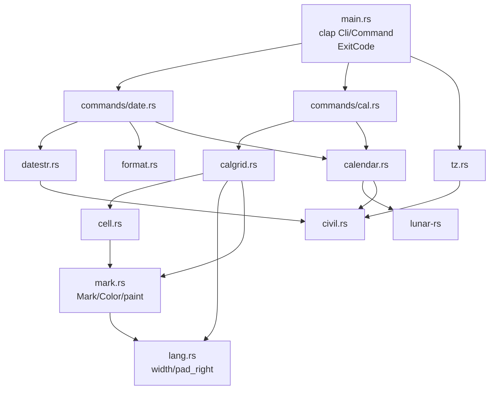

# Repository Guidelines

## Project Overview

`lunar` is a single-crate Rust CLI (binary `lunar`) that prints Chinese lunisolar-calendar
information. Two subcommands:

- `lunar date` — one day's almanac profile (公历 / 星期 / 农历 / 干支 / 生肖 / 节气 / 法定),
  a custom `-f` format, and a lunar-input mode (`-l`, with `-R` for the leap month).
- `lunar cal` — `cal`-style month/year grids overlaid with lunar days, the 24 solar terms,
  traditional festivals and the 法定节假日 (放假 / 调休), over civil months or, with `-L`,
  lunar months. Three kinds of day are **painted** (SGR), never decorated with characters:
  the reference day, 放假 and 调休.

All astronomy is delegated to the [`lunar-rs`](https://crates.io/crates/lunar-rs) crate (a
ShouXing / 寿星天文历 port). **This repo never implements calendar math itself** — it parses
input, shapes `lunar-rs` output, and renders grids. Supported range is civil years
**1–9999** (`MIN_YEAR`/`MAX_YEAR`, `src/calendar.rs:21,24`). Before writing any
calendar logic, read *Dependency First* below.

## Dependency First: Check `lunar-rs` Before Implementing

**All calendar computation belongs to `lunar-rs`.** This repo is a CLI shell
around it: argument parsing, output shaping, and grid layout. Before writing
any code that answers a calendar question, **search the engine for an existing
implementation and use it.** Do not reimplement what it already does — not the
astronomy, not the tables, not the date arithmetic.

This is not a formality. `Solar` exposes **144** public methods and `Lunar`
**305**, across roughly thirty calendar systems (Foto, Minguo, Dangi, Coptic,
Hijri, Julian, …), plus `solar_util`, `lunar_util`, `holiday_util` and the
ShouXing astronomy in `shou_xing/`. The odds that a question you are about to
answer by hand is already answered are high.

The upstream checkout is at `~/projects/lunar-rs` — read it directly. Do not
work from memory of the crate; the API is large and moves.

| To find | Look in |
|---|---|
| A date conversion or attribute | `src/solar.rs`, `src/lunar.rs` — `grep 'pub fn' ` |
| Name tables (weekday, month, day, ganzhi, zodiac) | `src/solar_util.rs`, `src/lunar_util/tables.rs` |
| Festival and term lookup | `src/festival.rs`, `src/lunar_util/maps.rs`, `src/solar_util.rs` |
| Other calendar systems | `src/<system>.rs`, all re-exported from `src/lib.rs` |
| The astronomy itself | `src/shou_xing/` |
| The 法定节假日 table (放假 / 调休) | `src/holiday_util.rs`, `src/holiday.rs`, `src/holiday_data.rs` — `Solar::get_legal_holiday` |

Two consequences for this codebase:

1. **Add to `src/calendar.rs`, not to the command modules.** It is the single
   boundary to the engine; every wrapper in it is a one-line forward. A second
   path to `lunar-rs` is a design regression.
2. **When the engine has a quirk, adapt it — do not patch around it.** The
   wrappers exist precisely for that (`lunar_month_start` filters the
   lunar-new-year window, `solar()` maps `GregorianGap`). If you find yourself
   writing a table, a lookup, or arithmetic that the engine already owns, stop:
   you are duplicating work that is better fixed upstream.

**Counter-example to keep in mind:** 国庆节 was missing from every grid for the
life of this tool because the code consulted only `Lunar::festivals()`. The
civil festivals live in `Solar::festivals()`. The engine had them all along;
the mistake was not reading its API before using it.

## Architecture & Data Flow

There is **no `lib.rs`** — everything is binary-internal, declared in `src/main.rs:12-19`.
Each module has one job and the dependency direction is strictly one-way:



- `src/calendar.rs` — the **only** module that talks to `lunar-rs` for calendar answers.
  Owns `CalError`, `MIN_YEAR`/`MAX_YEAR`, and one-line wrappers (`lunar_month_name`,
  `jie_qi`, `year_gan_zhi`, `traditional_festivals`, …). Wrappers exist to *shape* output
  or to adapt an engine quirk, never to add logic of their own.
- `src/civil.rs` — proleptic-Gregorian epoch ↔ civil-date bridge (Hinnant's
  `days_from_civil`/`civil_from_days`) and `CivilDate` stepping. It exists because
  `lunar-rs`' `Solar` deliberately models the 1582 reform and rejects
  `1582-10-05..=1582-10-14`, which the `-d` parser and grid stepping must cross.
- `src/calgrid.rs` — grid layout: `Entry`/`Grid`, pitch constants, `render`. Each `Entry`
  carries the `Mark` the cell is painted with; `day_mark` resolves it.
- `src/cell.rs` — the cell-content **priority policy** (see below).
- `src/datestr.rs` — the `date(1)`-style `-d` parser.
- `src/format.rs` — the `-f` token engine.
- `src/commands/` — the two subcommand implementations.
- `src/lang.rs` — the display-width measurement the grid depends on.
- `src/mark.rs` — the reference-day / 放假 / 调休 `Mark`s, the `Color` mode, and `paint`,
  the one place an SGR run is written.

**Data flow.** `main()` parses clap, resolves `today` once via `tz::today()`, builds one
`String` buffer, dispatches to `date::run` / `cal::run`, and writes the buffer to stdout in
a single `write_all` (`src/main.rs:210-220`). On `Err` it prints `lunar: {error}` to
stderr, returns `ExitCode::FAILURE`, and **discards the whole buffer** — so a mid-loop
failure in `cal` prints nothing to stdout.

Both commands share the same signature contract:

```rust
pub fn run(args: &XArgs, today: CivilDate, out: &mut String) -> Result<(), CalError>
```

**Consequence: command modules must never print.** They append to `out` and return an
error. This is what makes the integration tests possible.

`lunar-rs` quirk: `LunarYear::get_month`/`LunarMonth::get_first_day` walk the lunar-new-year
window and can return a day belonging to a *neighbouring* year. `calendar::lunar_month_start`,
`lunar_year_month` and `lunar_year_months` (`src/calendar.rs:232-262`) exist purely to
filter/fix that. Any new lunar-month lookup must go through them.

`lunar-rs` quirk: `Lunar::from_ymd` walks the lunar-new-year window as well, so
`calendar::solar_from_lunar` re-checks that the resolved `Solar` still belongs to the
requested lunar year — otherwise a leap month of the neighbouring year is accepted and
silently answers with a day from the wrong year. Use that wrapper, never
`Lunar::from_ymd`, for any lunar→civil lookup.

## Key Directories

| Path | Purpose |
|---|---|
| `src/` | 9 modules + `src/commands/`; ~2.3k lines total |
| `src/commands/` | `mod.rs`, `date.rs`, `cal.rs` — CLI surface only |
| `tests/` | exactly one integration-test file, `documented_examples.rs` |
| `target/` | build output, gitignored (`.gitignore` = `/target`) |

## Development Commands

```bash
cargo build --release        # release: lto=true, codegen-units=1, strip=true
cargo run -- cal 2026 9      # civil-month grid
cargo run -- cal -L 2026 7   # lunar-month grid
cargo run -- date -d 2026-09-07
cargo test                   # the integration suite
cargo fmt                    # required: `cargo fmt --check` is clean at HEAD
cargo clippy --all-targets   # required: zero warnings at HEAD
```

There is **no CI, no Makefile/justfile, no `rust-toolchain.toml`, no `rustfmt.toml`, no
`[lints]` block and no dev-dependencies.** The lint/format gate is whatever you run
locally; keep both clean. `Cargo.lock` is tracked; `target/` is not.

## Code Conventions & Common Patterns

**Comment / language policy (strictly mixed).**

- Module, function and struct doc-comments are **English prose**; every `pub` item carries
  one. Do not add Chinese prose to doc-comments.
- **All user-facing strings are Chinese**, including error messages, grid titles, cell
  labels and the clap `///` help on the subcommand variants (`src/main.rs:52-150`).
- Error `Display` strings are Chinese and full-width-punctuated (`src/calendar.rs:60-103`).
  `tests/documented_examples.rs` substring-matches these strings, so **changing an error
  message is a breaking change for the suite**.

**Formatting.** Plain `rustfmt` defaults, no config file. One import per line, no glob
imports, imports grouped std / external / `crate::` separated by blank lines.

**Error handling.** One error type, `CalError` (`src/calendar.rs:28-53`), with a hand-written
Chinese `Display` and `impl std::error::Error`. Every fallible path returns
`Result<_, CalError>`; no `unwrap`/`expect` in `src/` (they appear only in `tests/`).
Helper constructors: `check_year` / `check_month` / `check_day` / `check_lunar_month` /
`solar` / `solar_from_lunar`.

**Output rendering.** Build into `&mut String` via `std::fmt::Write`
(`let _ = write!(out, …)`), never `println!`, except the `--help-format` short-circuit
(`src/main.rs:162`). Note the deliberate `let _ =` on `write!` — a `String` cannot fail, so
the result is ignored rather than propagated.

**Dependency injection / state.** There is no DI framework and no global state. The two
injection points are the explicit `today: CivilDate` parameter (making every command
deterministic and testable) and the `CellStyle` value struct, which is the single
configuration seam into the rendering policy. Flags are mapped to `CellStyle` in exactly
one place, `cal::run` (`src/commands/cal.rs:57-63`); keep it that way. The `Color` mode is
resolved in `main` and passed beside `today`, not read from a global.

**Cell priority is policy, not configuration.** `cell::content` (`src/cell.rs`) is the
single source of truth, in this order:

```text
法定节假日 > 节日 > 初一显示月份名 > 节气 > 农历日
```

The month-name level is skipped on 正月 (so 春节 keeps its festival label), and
`--number` only affects the final 农历日 level, never the priority. Do not reorder or
reimplement this outside `cell.rs`.

**The 法定节假日 level is a table, not a festival.** `calendar::legal_holiday` reads
`holiday_util::get_holiday_by_ymd`, which is the State Council's published calendar:
`is_work` false is 放假, true is 调休. It sits above the festivals because it answers a
question no festival can — 2026 春节 is seven days, and 青年节 falls inside the 劳动
节 holiday. A 放假 day whose name a traditional festival already supplies shows
`mark::REST_LABEL` (放假) so the cell does not print 中秋节 twice; a 调休 workday shows
`mark::WORK_LABEL` (班) and outranks every other level, because a working Saturday
reading 七夕 is a lie. The engine ships only the years it was given (2001–2026 at
1.0.0-rc1): a grid outside the window shows festivals and no statutory marks. Do not
derive workdays from the weekday instead — a 调休 Saturday is exactly the day the two
disagree.

**Marks are attributes, never characters.** `mark::paint` is the only place an SGR run
is written. A cell that carried a character decoration would shift the display-width
padding, so today / 放假 / 调休 are painted (`31` red, `1;93` bold bright, `7`
inverse) and the *text* repeats the information — 放假 in the cell, 班 for a workday —
so a piped or redirected grid loses only the highlighting.
`Color::Auto` keys off `stdout().is_terminal()`;
`--color` / `--no-color` override it, and the colour mode is resolved once in `main`
and passed down, so no module holds global state. The padding goes *inside* the SGR run,
which is why a colourless and a coloured grid differ in trailing spaces only.

**Both calendars' festivals are consulted.** `calendar::traditional_festivals`
takes *both* a `Solar` and a `Lunar` and chains `Solar::festivals()` (civil:
国庆节, 劳动节, plus the weekday-floating ones) with `Lunar::festivals()`
(lunar: 春节, 中秋节). Consulting only the `Lunar` half silently drops every
civil festival — an October grid read `廿一` where 国庆节 belongs. When a day
carries several, `festival_rank` prefers the one a reader scans for.

**Leap months are negative numbers.** A leap fourth month is `-4`; `m_abs`
(`src/calendar.rs:108-112`) renders the 闰 prefix. Keep the sign convention.

**Grid width is a display width, measured by `lang::width`.** CJK ideographs and
full-width forms count 2 columns, everything else 1. Padding is manual
(`lang::pad_right`), not `{:>width$}`, because Rust's format width counts
*characters* and would misalign every CJK cell. The column width is the widest
label or content the grid holds — there is no cap and no truncation, since the
longest Chinese cell (`中秋节`, `闰四月`) is 6 columns — and every row of a grid
shares it, because per-row auto-fit would misalign the columns.

**Keep `GUTTER`.** A cell that exactly fills its column leaves no space
before its neighbour, and the narrow grids hit this: 闰四月 has no festival, so
its column is 4 columns for `5/23`, and with no gutter the row renders
`5/235/245/27`. It is easy to miss because the months that *do* carry a
6-column festival are wide enough to hide the defect.
`cells_never_run_together` pins it.

**One language: Simplified Chinese.** There is no language selection and no
translation table. Every user-facing string is Chinese, and names the engine
owns — weekdays, ganzhi, solar terms, festivals, month and day names — are used
as `lunar-rs` supplies them. `src/lang.rs` holds only the width measurement and
`pad_right`; it has no `Terms`, no `Language`, and reads no environment
variable. **Do not reintroduce a language layer without being asked**: it is
the change that made the grid layout (column width, truncation) hardest.

**No async.** Entirely synchronous; there is nothing to await.

## Important Files

| File | Role |
|---|---|
| `src/main.rs` | clap `Cli`/`Command` derive, `FORMAT_HELP`, dispatch, exit codes |
| `src/calendar.rs` | `CalError`, year range, all `lunar-rs` shaping |
| `src/civil.rs` | `CivilDate`, epoch math, reform-gap workarounds |
| `src/calgrid.rs` | `Grid::lunar` / `Grid::civil_blanked` / `Grid::render` |
| `src/cell.rs` | cell priority + `CellStyle` |
| `src/datestr.rs` | `-d` grammar |
| `src/format.rs` | `-f` token table |
| `src/lang.rs` | `width`, `pad_right` |
| `src/mark.rs` | `Mark`, `Color`, `paint` — the only SGR writer |
| `src/commands/{date,cal}.rs` | subcommand logic |
| `tests/documented_examples.rs` | the entire test suite |
| `Cargo.toml` | 19 lines; no workspace, no lints, no dev-deps |

**Adding a `-f` token:** extend the `match` in `format.rs` **and** both user-facing
tables — the `FORMAT_HELP` string (`src/main.rs:32-40`) and the README table
(`README.md:120-134`). The token table is duplicated in three places by design (help text,
README, module doc `src/format.rs:5-19`); all three must stay in sync.

**`-d` is 公历, `-l` is 农历, and the two differ in nothing else.** This is the
invariant, and it is what broke once: `-l` originally re-read only the positionals, so
`date -l 2026-03-01` silently answered with a 公历 date. `datestr::parse` now takes a
`datestr::Calendar`, and *both* channels go through it — a `-d` string and a single
positional through `parse`, the three positionals through `from_parts`. The grammar
(`parse_absolute`) is read once into a `Parts` triple and `resolve` decides which
calendar the triple is read in, so a form one channel accepts the other must accept too,
with the same failure.

**Adding a `-d` form:** extend `parse`'s precedence chain. Order matters and is
first-match-wins: keyword → `@epoch` → absolute → weekday → relative. Add a unit to
`apply_unit`, which currently knows fortnight/day/week/month/year and treats sub-day
units as a **no-op**. A new *absolute* shape must go through `Parts` + `resolve`, never
call `calendar::solar` itself, or it will be civil-only.

**What `-l` must not change:** keyword, `@epoch`, weekday and relative forms name a
*day*, not a date written in a calendar, so they resolve against the reference exactly as
before. A time-of-day suffix is civil-only and is **refused** under `-l` rather than
dropped — a lunar date must never look like it honoured a time it threw away.

`the_two_channels_differ_only_in_the_calendar_they_read` and
`day_relative_forms_are_unaffected_by_the_calendar_flag` pin both halves of that.

## Runtime/Tooling Preferences

- **Rust 2024 edition** (`Cargo.toml:4`) — `edition = "2024"`, so let-chains
  (`if cond && let Some(x) = …`, used at `src/cell.rs:104`) are available.
- Toolchain is the **distro `rust` package** (1.98.1 at time of writing), not rustup.
  There is no pinned `rust-toolchain.toml`; do not add one or install a second toolchain.
- Package manager is **cargo** with the user's `~/.cargo/config.toml` crates.io mirror.
  Use `cargo` directly; no wrapper, no workspace.
- `Cargo.lock` is committed — commit it alongside any dependency change.
- The dependency `tz` is a **rename** of `tz-rs` (`Cargo.toml:14`); in code it is
  `use tz::{…}`. The other direct deps are `clap` (derive feature) and `lunar-rs`
  (the `i18n` feature supplies the Chinese name tables).

## Testing & QA

**One test file, one mechanism.** `tests/documented_examples.rs` is the whole
suite. There are **no `#[cfg(test)]` unit tests in `src/`** and no mocking,
fixtures, or snapshot framework. Every test spawns the real binary:

```rust
fn binary() -> Command                 // the compiled binary
fn run(args: &[&str]) -> String        // asserts success, trims trailing '\n'
fn run_failing(args: &[&str]) -> String // asserts failure, returns stderr
```

**No locale is set.** The tool speaks Simplified Chinese unconditionally, so
tests spawn the binary with an inherited environment and compare its output
directly.

**How to write a new test.** Add a `#[test]` using `run` / `run_failing`
and compare exact output. Three tests pin whole grids byte-for-byte via raw-string
literals; the rest use `contains`, line-count or column-index probes. **Copy
expected grid text from real binary output** — never hand-compute the padding,
because it is measured in display columns. The column width is per-grid: it is
the widest cell the month happens to hold, so two months of the same year pad
differently.

**What the suite pins:** the `date` profile lines, the whole `-f` token table, the civil and
lunar grid layouts, `--number` / `--no-month-name` / `--no-festival` / `--no-holiday`,
`-s` column shifting, `--color` / `--no-color` (SGR present, and stripping it reproduces
the uncoloured grid), `-R` leap-month gating, the two `date` channels agreeing except in
the calendar they read (including `-R` through `-d`), the keyword / `@epoch` / weekday /
relative forms being unaffected by `-l`, a
time-of-day refused on a lunar date, the `date -l` error paths, bare-year and month-span
behaviour, the year-range and reform-gap error messages, both calendars' festivals
(国庆节 as well as 中秋节), the 法定节假日 cells by date (2026-10-01 放假, 2026-10-10 班),
the `法定` line of the profile, and — separately —
calendar values **by date** (芒种 on 2020-06-05, …).

**The reference day is not a testable input.** `tz::today()` is the only source of it, so
the suite cannot pin what a grid marks as today and must not try: assert the statutory
marks and the text instead, and leave the highlight to `--color` (which is
deterministic) rather than to a pty.

**Pinned grids drift with the statutory table.** `civil_overlay_grid_matches_documented_output`
and the three whole-year expectations embed 放假 / 班 cells, because the grid now shows
them. That is intentional: a grid of 2026 is not the same grid it was before this
level existed.

**Engine wins over samples.** Where the published samples and the astronomy disagree, the
engine is correct and the sample is stale. The suite says so explicitly at
`tests/documented_examples.rs:1-6`, and `README.md:299-301` repeats it. Stale cells include
中元 three days early, 芒种 on the wrong day, and 雨水/惊蛰 missing. **Do not "fix" the
engine to match a sample.**

**Beyond pinning layouts, the suite pins an invariant** a renderer can easily
break: that every month of the year shows every one of its days, in order
(`civil_grid_shows_every_day_of_the_month`).

**Coverage gaps to be aware of when editing `src/datestr.rs`:** the epoch, keyword, relative
and weekday paths were uncovered until `day_relative_forms_are_unaffected_by_the_calendar_flag`
added them; the **zone** path (`+08:00`, `Z`) still has no coverage — `zone_offset` cannot
see a sign (see Known Defects), so a test would pin a broken behaviour. The bare-year form
is uncovered too. A change to any of those needs a test you add yourself.

## Known Defects (verified, not yet fixed)

Do not treat these as intended behaviour, and do not "fix" them silently as a side effect
of unrelated work — surface them, or fix them deliberately with a test.

- **Any grid spanning 1582-10-05..14 fails outright.** `CivilDate::add_days` is proleptic
  but each slot is validated with `to_solar()`, so a month whose slot window crosses the
  reform gap dies with the `YearMissing` message. Verified: `cal 1582 10` errors, while
  `cal 1582 9` and `cal 1582 11` render fine.
- `CalError::TodayOutOfRange` overloads four unrelated failures — an unparsable `TZ`, a
  missing `/etc/localtime`, a clock before 1970, and a local year outside 1–9999
  (`src/tz.rs:19,21,33,36`; `src/calendar.rs:120`) — all printing
  `当前日期超出支持范围 (1–9999 年)`. Verified: `TZ=Asia/Shangahi lunar date` reports a
  date-range problem, not a bad zone.
- **`-d` rejects numeric zone offsets.** `split_zone` returns a slice starting one byte
  *before* the sign (`&rest[index - 1..]`, `src/datestr.rs:297`), so `zone_offset`'s
  `bytes.first()` never sees `+`/`-` and returns `None`. `2026-09-07T15:30+08:00` fails,
  contradicting the README's `-d` grammar. Only `Z`/`UTC`/`GMT` suffixes work — and they all offset by
  zero, so they can never change the day.
- **`-d` rejects `next month` / `next week` / `last year`** — advertised in the README and
  reachable at `src/datestr.rs:383`. `apply_unit` has no `next`/`last` arm, so the bare word hits the
  error arm. (`next friday` works, because `parse_weekday` runs first.)
- **`MM/DD/YYYY` is unreachable.** The short-year branch (`src/datestr.rs:175-190`) matches
  any 1–3-digit-leading `/`-separated triple first, so `09/07/2026` parses as year 9 and
  then fails validation. The README advertises this form.
- `20260907T1530` and a bare `2026-09-07Z` both fail — `parse_clock`
  (`src/datestr.rs:340`) has no compact `HHMM` form and returns `None` for an empty clock.
- Sub-day relative units (`90 minutes ago`, `2 hours`) are accepted but are **no-ops**
  (`src/datestr.rs:435-436`).
- `src/format.rs:20-21` no longer claims `\%` yields a literal `%`; the code emits `\%`
  (two chars). Use `%%`. `\r` works but is still undocumented.
- ~~The same bad date yields different messages depending on the input channel.~~ **Fixed.**
  Both channels now resolve through `datestr`, so `2023-02-30` is `公历 2023-02-30
  不存在` either way, and out-of-range components give `月份 13 非法 (应为 1–12)` on both.
- `cal` uses `CalError::MonthOutOfRange { month: -1 }` as a generic "bad argument" sentinel
  (`src/commands/cal.rs`), producing the misleading `月份 -1 非法 (应为 1–12)`.
- `-3` / `-n N` are silently ignored under `-L` whenever a positional is present.
- `src/main.rs` parses `-m/--monday` and discards it; Monday is hard-coded. The README
  options table implies otherwise.
- **The 法定节假日 table stops at 2026.** `lunar-rs` ships 2001–2026, so a grid outside
  that window shows festivals and no statutory marks: `cal 2027 1` reads 廿五 for 2
  January, not 放假, and `cal 2000 1` reads 廿六 for 2 January. It is a data limit
  upstream, not a lookup bug — do not fall back to weekday heuristics to paper over it.
- The statutory names are the engine's, and one is a mainland-Chinese compound:
  `国庆中秋` for 2020 and 2025, where the two coincide. That is the upstream
  `holiday_data` NAMES table; the CLI renders what it is given.
