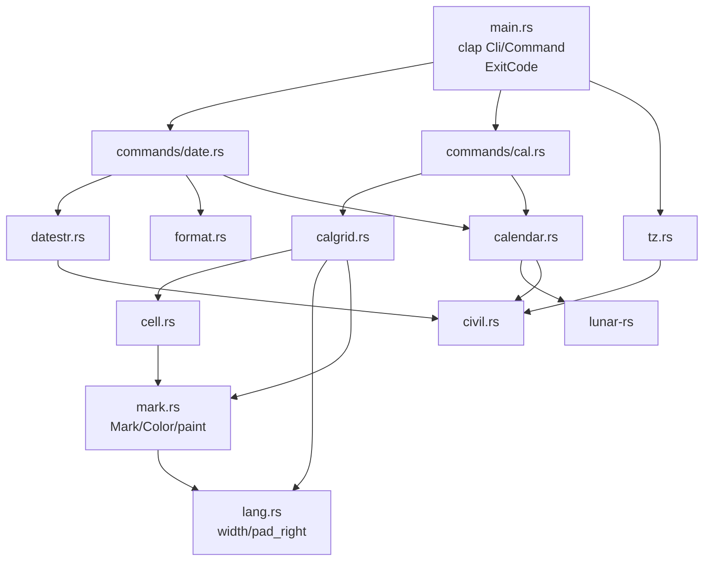

# Repository Guidelines

## Project Overview

`lunar` is a single-crate Rust CLI (binary `lunar`) that prints Chinese lunisolar-calendar
information. Two subcommands:

- `lunar date` — one day's almanac profile (公历 / 星期 / 农历 / 干支 / 生肖 / 节气 / 法定),
  a custom `-f` format, and a lunar-input mode (`-l`, with `-R` for the leap month).
- `lunar cal` — `cal`-style month/year grids overlaid with lunar days, the 24 solar terms,
  traditional festivals and the 法定节假日 (放假 / 调休), over civil months or, with `-L`,
  lunar months. Three kinds of day are **painted** (SGR), never decorated with characters:
  放假, 调休 and the reference day — all attributes, and they **compose**: a day that is
  both a 放假 and today is red and inverted at once.

All astronomy is delegated to the [`lunar-rs`](https://crates.io/crates/lunar-rs) crate (a
ShouXing / 寿星天文历 port). **This repo never implements calendar math itself** — it parses
input, shapes `lunar-rs` output, and renders grids. Supported range is civil years
**1–9999** (`MIN_YEAR`/`MAX_YEAR`, `src/calendar.rs:21,24`). Before writing any
calendar logic, read *Dependency First* below.

## Dependency First: Check `lunar-rs` Before Implementing

**All calendar computation belongs to `lunar-rs`.** This repo is a CLI shell
around it: argument parsing, output shaping, and grid layout. Before writing
any code that answers a calendar question, **search the engine for an existing
implementation and use it.** Do not reimplement what it already does — not the
astronomy, not the tables, not the date arithmetic.

This is not a formality. `Solar` exposes **144** public methods and `Lunar`
**305**, across roughly thirty calendar systems (Foto, Minguo, Dangi, Coptic,
Hijri, Julian, …), plus `solar_util`, `lunar_util`, `holiday_util` and the
ShouXing astronomy in `shou_xing/`. The odds that a question you are about to
answer by hand is already answered are high.

The upstream checkout is at `~/projects/lunar-rs` — read it directly. Do not
work from memory of the crate; the API is large and moves.

| To find | Look in |
|---|---|
| A date conversion or attribute | `src/solar.rs`, `src/lunar.rs` — `grep 'pub fn' ` |
| Name tables (weekday, month, day, ganzhi, zodiac) | `src/solar_util.rs`, `src/lunar_util/tables.rs` |
| Festival and term lookup | `src/festival.rs`, `src/lunar_util/maps.rs`, `src/solar_util.rs` |
| Other calendar systems | `src/<system>.rs`, all re-exported from `src/lib.rs` |
| The astronomy itself | `src/shou_xing/` |
| The 法定节假日 table (放假 / 调休) | `src/holiday_util.rs`, `src/holiday.rs`, `src/holiday_data.rs` — `Solar::get_legal_holiday` |

Two consequences for this codebase:

1. **Add to `src/calendar.rs`, not to the command modules.** It is the single
   boundary to the engine; every wrapper in it is a one-line forward. A second
   path to `lunar-rs` is a design regression.
2. **When the engine has a quirk, adapt it — do not patch around it.** The
   wrappers exist precisely for that (`solar()` maps `GregorianGap`,
   `solar_from_lunar` round-trips across the lunar/civil year mismatch). If
   you find yourself writing a table, a lookup, or arithmetic that the engine
   already owns, stop: you are duplicating work that is better fixed upstream —
   and a wrapper that once adapted a quirk may itself now be dead weight, so
   check that it still changes anything before keeping it.

**Counter-examples to keep in mind.** 国庆节 was missing from every grid for the
life of this tool because the code consulted only `Lunar::festivals()`. The
civil festivals live in `Solar::festivals()`. The engine had them all along;
the mistake was not reading its API before using it. The same mistake repeated
with `Lunar::festivals()` itself: 清明节, 上巳节, 中元节 and 冬至节 are in the
engine but in the **typed** `LunarFestival` table, not the string list, and
reading the wrong one of two APIs the engine offers loses a holiday just as
silently. Read the whole API before concluding the engine lacks something.

## Architecture & Data Flow

There is **no `lib.rs`** — everything is binary-internal, declared in `src/main.rs:12-19`.
Each module has one job and the dependency direction is strictly one-way:



- `src/calendar.rs` — the **only** module that talks to `lunar-rs` for calendar answers.
  Owns `CalError`, `MIN_YEAR`/`MAX_YEAR`, and one-line wrappers (`lunar_month_name`,
  `jie_qi`, `year_gan_zhi`, `traditional_festivals`, …). Wrappers exist to *shape* output
  or to adapt an engine quirk, never to add logic of their own.
- `src/civil.rs` — proleptic-Gregorian epoch ↔ civil-date bridge (Hinnant's
  `days_from_civil`/`civil_from_days`) and `CivilDate` stepping. It exists because
  `lunar-rs`' `Solar` deliberately models the 1582 reform and rejects
  `1582-10-05..=1582-10-14`, which the `-d` parser and grid stepping must cross.
- `src/calgrid.rs` — grid layout: `Entry`/`Grid`, pitch constants, `render`. Each `Entry`
  carries the `Mark` the cell is painted with; `day_mark` resolves it.
- `src/cell.rs` — the cell-content **priority policy** (see below).
- `src/datestr.rs` — the `date(1)`-style `-d` parser.
- `src/format.rs` — the `-f` token engine.
- `src/commands/` — the two subcommand implementations.
- `src/lang.rs` — the display-width measurement the grid depends on.
- `src/mark.rs` — the reference-day / 放假 / 调休 `Mark`s, the `Color` mode, and `paint`,
  the one place an SGR run is written.

**Data flow.** `main()` parses clap, resolves `today` once via `tz::today()`, builds one
`String` buffer, dispatches to `date::run` / `cal::run`, and writes the buffer to stdout in
a single `write_all` (`src/main.rs:210-220`). On `Err` it prints `lunar: {error}` to
stderr, returns `ExitCode::FAILURE`, and **discards the whole buffer** — so a mid-loop
failure in `cal` prints nothing to stdout.

Both commands share the same signature contract:

```rust
pub fn run(args: &XArgs, today: CivilDate, out: &mut String) -> Result<(), CalError>
```

**Consequence: command modules must never print.** They append to `out` and return an
error. This is what makes the integration tests possible.

**There is no lunar-new-year window leak in `lunar-rs` 1.0.0-rc1.** Earlier versions of this
module filtered `LunarYear::get_month`, `LunarYear::months` and `LunarMonth::get_first_day`
because they were believed to return a neighbouring year's month. They do not: `get_month`
matches on `m.year == self.year` itself, and `months_in_year()` is the in-year view. Swept
over all 9,999 years, the filters changed nothing — `get_month` returned a foreign year 0
times, and the hand-rolled filter differed from `months_in_year()` in 0 years.
`lunar_year_month`, `lunar_year_months` and `lunar_month_start` are now plain forwards, and
`lunar_month_start` is `first_solar_day` with no offset correction: the correction it used to
apply fired 0 times across 123,670 months. **Do not re-add a window filter without first
measuring that the leak exists** — and if a future `lunar-rs` reintroduces one, fix it by
re-testing the whole range, not by copying the old code back.

`lunar-rs` quirk: a lunar year and a civil year do **not** line up — 腊月 always begins
in the following January, so 农历 2026 年腊月初一 is 公历 2027-01-08. `calendar::solar_from_lunar`
therefore validates by **round trip**: convert the resolved `Solar` back to a `Lunar` and require
the whole year / month / day triple to match. Comparing *civil* years instead refuses every
such day — 336,947 of the 3,652,046 days in 1–9999 — and makes 腊月, 闰腊月 and the two 正月
that begin in December unreachable. Use that wrapper, never `Lunar::from_ymd`, for any
lunar→civil lookup.

## Key Directories

| Path | Purpose |
|---|---|
| `src/` | 9 modules + `src/commands/`; ~2.3k lines total |
| `src/commands/` | `mod.rs`, `date.rs`, `cal.rs` — CLI surface only |
| `tests/` | exactly one integration-test file, `documented_examples.rs` |
| `target/` | build output, gitignored (`.gitignore` = `/target`) |

## Development Commands

```bash
cargo build --release        # release: lto=true, codegen-units=1, strip=true
cargo run -- cal 2026 9      # civil-month grid
cargo run -- cal -L 2026 7   # lunar-month grid
cargo run -- date -d 2026-09-07
cargo test                   # the integration suite
cargo fmt                    # required: `cargo fmt --check` is clean at HEAD
cargo clippy --all-targets   # required: zero warnings at HEAD
```

There is **no CI, no Makefile/justfile, no `rust-toolchain.toml`, no `rustfmt.toml`, no
`[lints]` block and no dev-dependencies.** The lint/format gate is whatever you run
locally; keep both clean. `Cargo.lock` is tracked; `target/` is not.

## Commit Discipline

**One completed feature per commit.** A commit is one coherent, working
change — a fix, a behaviour, a doc correction — and nothing else. Never
batch two features, and never let a commit sit half-done: a commit that
does not build, does not pass `cargo test`, or leaves the tree in a
state a reader cannot check out and understand is not a commit yet.

**Commit documentation and behaviour together.** A change to a
user-facing string moves the README, the `-f` tables, and the
`Known Defects` list in the *same* commit as the code. A defect fixed is
struck through or deleted in the same commit that fixes it — the list
describes the state of the tree, not its history.

**Message.** One imperative subject line, under 72 characters, naming the
behaviour and not the files; the body explains what was wrong, why it
mattered, and what changed. The recent history is prose subjects
(`Paint the statutory calendar and the reference day, and drop the cell
labels`), not conventional-commit prefixes.

**Never `git push` without an explicit instruction.** Commit locally as
far as the work goes; pushing is the user's call and requires a direct
request. Do not push "to finish up", do not push because a branch is
ahead, and do not run `git push` as part of any other command.

## Code Conventions & Common Patterns

**Comment / language policy (strictly mixed).**

- Module, function and struct doc-comments are **English prose**; every `pub` item carries
  one. Do not add Chinese prose to doc-comments.
- **All user-facing strings are Chinese**, including error messages, grid titles, cell
  labels and the clap `///` help on the subcommand variants (`src/main.rs:52-150`).
- Error `Display` strings are Chinese and full-width-punctuated (`src/calendar.rs:60-103`).
  `tests/documented_examples.rs` substring-matches these strings, so **changing an error
  message is a breaking change for the suite**.

**Formatting.** Plain `rustfmt` defaults, no config file. One import per line, no glob
imports, imports grouped std / external / `crate::` separated by blank lines.

**Error handling.** One error type, `CalError` (`src/calendar.rs:28-53`), with a hand-written
Chinese `Display` and `impl std::error::Error`. Every fallible path returns
`Result<_, CalError>`; no `unwrap`/`expect` in `src/` (they appear only in `tests/`).
Helper constructors: `check_year` / `check_month` / `check_day` / `check_lunar_month` /
`solar` / `solar_from_lunar`.

**Output rendering.** Build into `&mut String` via `std::fmt::Write`
(`let _ = write!(out, …)`), never `println!`, except the `--help-format` short-circuit
(`src/main.rs:162`). Note the deliberate `let _ =` on `write!` — a `String` cannot fail, so
the result is ignored rather than propagated.

**Dependency injection / state.** There is no DI framework and no global state. The two
injection points are the explicit `today: CivilDate` parameter (making every command
deterministic and testable) and the `CellStyle` value struct, which is the single
configuration seam into the rendering policy. Flags are mapped to `CellStyle` in exactly
one place, `cal::run` (`src/commands/cal.rs:57-63`); keep it that way. The `Color` mode is
resolved in `main` and passed beside `today`, not read from a global.

**Cell priority is policy, not configuration.** `cell::content` (`src/cell.rs`) is the
single source of truth, in this order:

```text
节日 > 初一显示月份名 > 节气 > 农历日
```

The month-name level is skipped on 正月 (so 春节 keeps its festival label), and
`--number` only affects the final 农历日 level, never the priority. Do not reorder or
reimplement this outside `cell.rs`. **The statutory calendar is not a level here** — it
was one, showing 放假 and 班, and it was removed: it cost a 放假 day its festival name
and a 调休 workday its lunar day, which are the facts the tool exists to print.

**The 法定节假日 is a mark, not a label.** `calendar::legal_holiday` reads
`holiday_util::get_holiday_by_ymd`, which is the State Council's published calendar:
`is_work` false is 放假, true is 调休. It is a *third source*, kept apart from the
festival lists because it answers a question no festival can — 2026 春节 is seven days,
and 青年节 falls inside the 劳动 节 holiday. The engine ships only the years it was given
(2001–2026 at 1.0.0-rc1): a grid outside the window shows festivals and no statutory
marks. Do not derive workdays from the weekday instead — a 调休 Saturday is exactly the
day the two disagree.

**A mark is an attribute and nothing else.** `mark::paint` is the only place an SGR run
is written: `31` red for 放假, `1;93` bold bright for 调休, `7` inverse for the
reference day. A cell carrying a character decoration would shift the display-width
padding, and the text carries no statutory word at all.

**The two marks compose; neither wins.** `Mark` is a struct of a `Statutory`
variant plus a `today` flag, and `Mark::sgr` **joins** the parameters into one
run — a 放假 reference day is `\x1b[31;7m`, red and inverted at once, and a 调休
today is `\x1b[1;93;7m`. One attribute cannot say two things but an SGR run can
carry both, so the choice is never forced. An earlier version returned early and
let the statutory colour win outright; that was wrong, and
`the_statutory_calendar_and_the_reference_day_compose` pins the mechanism that
replaced it: a combined mark is a single run listing both parameters, and
`--no-holiday` must reduce it to the bare inversion, which is only possible if
the two were independent.

**The cost of that, stated plainly: a piped or redirected grid shows no mark.** The
alternative — repeating the information in the cell — was tried and removed; it
displaced the festival name and the lunar day to do it. `--color` is the way out for a
consumer that wants the escapes (`less -R`, `grep --color`), and `lunar date` still
reports the statutory calendar in words, because a line of text is the only surface it
has. `Color::Auto` keys off `stdout().is_terminal()`; `--color` / `--no-color` override
it, and the mode is resolved once in `main` and passed down, so no module holds global
state. The padding goes *inside* the SGR run, which is why a colourless and a coloured
grid differ in trailing spaces only — and why the suite's `split_on_pitch` must treat an
SGR run as occupying no column and must cut a cell boundary *before* a run that opens
the next cell.

**Three festival sources, and the third is not optional.** `calendar::traditional_festivals`
takes *both* a `Solar` and a `Lunar` and chains `Solar::festivals()` (civil: 国庆节,
劳动节, plus the weekday-floating ones) with `Lunar::festivals()` (春节, 中秋节).
Consulting only the `Lunar` half silently drops every civil festival — an October grid
read `廿一` where 国庆节 belongs.

The lunar half is **not** complete on its own. `Lunar::festivals()` is driven by
`lunar_util::FESTIVAL_INDEX`, a *different* table from the one the typed lookup uses, and it
omits 清明节, 上巳节, 中元节 and 冬至节 entirely — reading only the string list made all four
unreachable, and 七月十五 rendered as 十五. `LunarFestival::from_ymd` is the only source that
knows those names, so it is chained in as well. When a day carries several, `festival_rank`
prefers the one a reader scans for; its `PRINCIPAL` list must spell the names **as the engine
does** (`清明节`, `端午节`), since a name that matches nothing sorts last and loses.

**Leap months are negative numbers.** A leap fourth month is `-4`; `m_abs`
(`src/calendar.rs:115-124`) renders the 闰 prefix. Keep the sign convention. `m_abs` takes
**user input** — it formats the error arms of `CalError::message` — so it range-checks before
it indexes `lunar_util::MONTH` and prints the raw number when there is no month name. Its leap
prefix is the rule `Lunar::month_in_chinese` applies; the 月 suffix is this tool's, since the
engine's own name stops at 正 or 闰四. Do not call `Lunar::from_ymd` from it to borrow the name:
a fixed probe year has no leap month in most years, and searching for one costs a
thousand-plus conversions per grid cell.

**Grid width is a display width, measured by `lang::width`.** CJK ideographs and
full-width forms count 2 columns, everything else 1. Padding is manual
(`lang::pad_right`), not `{:>width$}`, because Rust's format width counts
*characters* and would misalign every CJK cell. The column width is the widest
label or content the grid holds — there is no cap and no truncation, since the
longest Chinese cell (`中秋节`, `闰四月`) is 6 columns — and every row of a grid
shares it, because per-row auto-fit would misalign the columns.

**Keep `GUTTER`.** A cell that exactly fills its column leaves no space
before its neighbour, and the narrow grids hit this: 闰四月 has no festival, so
its column is 4 columns for `5/23`, and with no gutter the row renders
`5/235/245/27`. It is easy to miss because the months that *do* carry a
6-column festival are wide enough to hide the defect.
`cells_never_run_together` pins it.

**One language: Simplified Chinese.** There is no language selection and no
translation table. Every user-facing string is Chinese, and names the engine
owns — weekdays, ganzhi, solar terms, festivals, month and day names — are used
as `lunar-rs` supplies them. `src/lang.rs` holds only the width measurement and
`pad_right`; it has no `Terms`, no `Language`, and reads no environment
variable. **Do not reintroduce a language layer without being asked**: it is
the change that made the grid layout (column width, truncation) hardest.

**No async.** Entirely synchronous; there is nothing to await.

## Important Files

| File | Role |
|---|---|
| `src/main.rs` | clap `Cli`/`Command` derive, `FORMAT_HELP`, dispatch, exit codes |
| `src/calendar.rs` | `CalError`, year range, all `lunar-rs` shaping |
| `src/civil.rs` | `CivilDate`, epoch math, reform-gap workarounds |
| `src/calgrid.rs` | `Grid::lunar` / `Grid::civil_blanked` / `Grid::render` |
| `src/cell.rs` | cell priority + `CellStyle` |
| `src/datestr.rs` | `-d` grammar |
| `src/format.rs` | `-f` token table |
| `src/lang.rs` | `width`, `pad_right` |
| `src/mark.rs` | `Mark`, `Color`, `paint` — the only SGR writer |
| `src/commands/{date,cal}.rs` | subcommand logic |
| `tests/documented_examples.rs` | the entire test suite |
| `Cargo.toml` | 19 lines; no workspace, no lints, no dev-deps |

**Adding a `-f` token:** extend the `match` in `format.rs` **and** both user-facing
tables — the `FORMAT_HELP` string (`src/main.rs:32-40`) and the README table
(`README.md:120-134`). The token table is duplicated in three places by design (help text,
README, module doc `src/format.rs:5-19`); all three must stay in sync.

**`-d` is 公历, `-l` is 农历, and the two differ in nothing else.** This is the
invariant, and it is what broke once: `-l` originally re-read only the positionals, so
`date -l 2026-03-01` silently answered with a 公历 date. `datestr::parse` now takes a
`datestr::Calendar`, and *both* channels go through it — a `-d` string and a single
positional through `parse`, the three positionals through `from_parts`. The grammar
(`parse_absolute`) is read once into a `Parts` triple and `resolve` decides which
calendar the triple is read in, so a form one channel accepts the other must accept too,
with the same failure.

**Adding a `-d` form:** extend `parse`'s precedence chain. Order matters and is
first-match-wins: keyword → `@epoch` → absolute → weekday → relative. Add a unit to
`apply_unit`, which currently knows fortnight/day/week/month/year and treats sub-day
units as a **no-op**. A new *absolute* shape must go through `Parts` + `resolve`, never
call `calendar::solar` itself, or it will be civil-only.

**What `-l` must not change:** keyword, `@epoch`, weekday and relative forms name a
*day*, not a date written in a calendar, so they resolve against the reference exactly as
before. A time-of-day suffix is civil-only and is **refused** under `-l` rather than
dropped — a lunar date must never look like it honoured a time it threw away.

`the_two_channels_differ_only_in_the_calendar_they_read` and
`day_relative_forms_are_unaffected_by_the_calendar_flag` pin both halves of that.

## Runtime/Tooling Preferences

- **Rust 2024 edition** (`Cargo.toml:4`) — `edition = "2024"`, so let-chains
  (`if cond && let Some(x) = …`, used at `src/cell.rs:104`) are available.
- Toolchain is the **distro `rust` package** (1.98.1 at time of writing), not rustup.
  There is no pinned `rust-toolchain.toml`; do not add one or install a second toolchain.
- Package manager is **cargo** with the user's `~/.cargo/config.toml` crates.io mirror.
  Use `cargo` directly; no wrapper, no workspace.
- `Cargo.lock` is committed — commit it alongside any dependency change.
- The dependency `tz` is a **rename** of `tz-rs` (`Cargo.toml:14`); in code it is
  `use tz::{…}`. The other direct deps are `clap` (derive feature) and `lunar-rs`
  (the `i18n` feature supplies the Chinese name tables).

## Testing & QA

**One test file, one mechanism.** `tests/documented_examples.rs` is the whole
suite. There are **no `#[cfg(test)]` unit tests in `src/`** and no mocking,
fixtures, or snapshot framework. Every test spawns the real binary:

```rust
fn binary() -> Command                 // the compiled binary
fn run(args: &[&str]) -> String        // asserts success, trims trailing '\n'
fn run_failing(args: &[&str]) -> String // asserts failure, returns stderr
```

**No locale is set.** The tool speaks Simplified Chinese unconditionally, so
tests spawn the binary with an inherited environment and compare its output
directly.

**How to write a new test.** Add a `#[test]` using `run` / `run_failing`
and compare exact output. Three tests pin whole grids byte-for-byte via raw-string
literals; the rest use `contains`, line-count or column-index probes. **Copy
expected grid text from real binary output** — never hand-compute the padding,
because it is measured in display columns. The column width is per-grid: it is
the widest cell the month happens to hold, so two months of the same year pad
differently.

**What the suite pins:** the `date` profile lines, the whole `-f` token table, the civil and
lunar grid layouts, `--number` / `--no-month-name` / `--no-festival` / `--no-holiday`,
`-s` column shifting, `--color` / `--no-color` (SGR present, and stripping it reproduces
the uncoloured grid), `-R` leap-month gating, the two `date` channels agreeing except in
the calendar they read (including `-R` through `-d`), the keyword / `@epoch` / weekday /
relative forms being unaffected by `-l`, a time-of-day refused on a lunar date, the
`date -l` error paths, bare-year and month-span behaviour, the year-range and reform-gap
error messages, a `-L` month outside `1..=12` reported rather than indexed
(`out_of_range_lunar_months_are_reported_not_indexed`), both calendars' festivals
(国庆节 as well as 中秋节), the 法定节假日
**painting** by date (2026-10-01 .. 10-07 red, 2026-10-10 bold bright), that a statutory
day still reads the calendar, that the statutory calendar and the reference day compose,
the `法定` line of the profile, and — separately —
calendar values **by date** (芒种 on 2020-06-05, …).

**The reference day is not a testable input.** `tz::today()` is the only source of it, so
the suite cannot assert "today is red and inverted" outright and must not try. It pins
the *mechanism* instead: `the_statutory_calendar_and_the_reference_day_compose` reads
every SGR run of a whole coloured year, checks that the statutory colours appear, that
at most one grid's worth of runs is inverted, and that `--no-holiday` reduces any
combined run to a bare inversion. That last observation is the real assertion: it holds
only if the two marks were independent, and a version that let one replace the other
could not produce a combined run to reduce.

**Reading a painted cell is not a `split_whitespace` away.** A painted cell is padded
*inside* its SGR run, so `国庆节    ` arrives as one word and the split drifts onto every
cell after it. `cell_of` / `paint_of` locate cells on the grid's **pitch** instead, which
requires `split_on_pitch` to treat an SGR run as occupying no column — and to cut a cell
boundary *before* a run that opens the next cell, or the escape lands at the end of the
previous slice. `strip_sgr` alone does not normalise that: the padding stays behind, so
grid comparisons trim each line.

**Engine wins over samples.** Where the published samples and the astronomy disagree, the
engine is correct and the sample is stale. The suite says so explicitly at
`tests/documented_examples.rs:1-7`, and `README.md:299-301` repeats it. Stale cells include
中元 three days early, 芒种 on the wrong day, and 雨水/惊蛰 missing. **Do not "fix" the
engine to match a sample.** (The 中元 entry is why the cell now reads 中元节 on 七月十五:
the sample is early, and the tool follows the engine.)

**Beyond pinning layouts, the suite pins an invariant** a renderer can easily
break: that every month of the year shows every one of its days, in order
(`civil_grid_shows_every_day_of_the_month`).

**Coverage gaps to be aware of when editing `src/datestr.rs`:** the epoch, keyword, relative
and weekday paths were uncovered until `day_relative_forms_are_unaffected_by_the_calendar_flag`
added them, and the **zone** path (`±hh:mm`, `Z`) was uncovered for as long as `zone_offset`
could not see a sign — a test would have pinned a broken behaviour, so none was written until
the off-by-one was fixed. `a_numeric_zone_offset_is_accepted_and_shifts_the_day` covers it now.
The bare-year form is still uncovered. A change to that needs a test you add yourself.

## Known Defects (verified, not yet fixed)

Do not treat these as intended behaviour, and do not "fix" them silently as a side effect
of unrelated work — surface them, or fix them deliberately with a test.

- ~~**Any grid spanning 1582-10-05..14 fails outright.**~~ **Fixed.** The grid stepped the
  month with `add_days` and validated every slot with `to_solar`, so October 1582 died on
  the first reform day. A **civil** month now enumerates the days that *exist*
  (`CivilDate::nth_existing_day`) instead of adding days, because the engine counts 21 days
  in that month and 31 in a proleptic one. The gap leaves no hole in the week: 4 October is
  a Thursday and the 15th a Friday, in adjacent columns, which is what the engine's own
  `week()` says. A **lunar** month still steps normally — the engine already counts its days
  in days that exist.
- ~~**`CalError::TodayOutOfRange` overloaded four unrelated failures.**~~ **Fixed.** An
  unparsable `TZ`, a missing `/etc/localtime`, a clock before 1970 and a local year outside
  1–9999 all printed `当前日期超出支持范围 (1–9999 年)`, so a typo'd `TZ` was answered with a
  statement about the calendar, sent to a reader whose calendar was fine. The zone failures
  are now `CalError::BadTimeZone { source }` — naming `TZ` or 系统时区 — and the clock is
  `CalError::ClockBeforeEpoch`. `TodayOutOfRange` itself had no constructor left once the
  year check went through `check_year` (`YearOutOfRange`), so it is gone rather than kept
  for a case that cannot occur.
- ~~**`-d` rejects numeric zone offsets.**~~ **Fixed.** `split_zone` returned a slice
  starting one byte *before* the sign (`&rest[index - 1..]`), so `zone_offset`'s
  `bytes.first()` never saw `+`/`-`. `Z`/`UTC`/`GMT` worked, which is why only the numeric
  forms looked broken. Every `±hh:mm` and `±hhmm` is accepted now, and the day moves when
  the zone crosses midnight — forwards or backwards. Note the sign is the **POSIX** one the
  module documents: `+0800` is 8 hours *behind* UTC, the opposite of ISO 8601.
- ~~**`-d` rejects `next month` / `next week` / `last year`.**~~ **Fixed.** `parse_weekday`
  already handled `next friday`, so the grammar looked covered, but `apply_unit` had no
  `next`/`last` arm and the bare word hit the error branch. The unit loop now consumes the
  word and takes the period that follows it, matching `date(1)` on every period.
- ~~**`MM/DD/YYYY` is unreachable.**~~ **Fixed.** The short-year branch claimed any
  `/`-separated triple whose first field is one to three digits, so `09/07/2026` arrived as
  the year 9 with a day of 2026 and then failed validation. The US order is tried **before**
  it, keyed on a four-digit *last* field — which is what distinguishes it from `2026/09/07` —
  and the old fixed-width branch that could never be reached is gone.
- ~~**`20260907T1530` and a bare `2026-09-07Z` both fail.**~~ **Fixed.** `parse_clock`
  split on `:` only, so the compact `hhmm` form — four digits, no separator, `1530` being
  15:30 and not the hour 1530 — had nowhere to go; and an empty clock was an error rather
  than midnight. A zone with no clock now means midnight in that zone, as `date(1)` does.
  A fourth colon-separated field is now rejected too, which it previously ignored.
- ~~**Sub-day relative units are accepted but are no-ops.**~~ **Fixed.** `apply_unit`
  returned the date unchanged, so `90 minutes ago` answered with today and read as though the
  offset had been applied. A new `CalError::SubDayUnit` refuses them and names the unit. The
  tool keeps a date and no clock, so there is nothing for a sub-day offset to move — a
  silent no-op was the one answer that could not be defended.
- `src/format.rs:20-21` no longer claims `\%` yields a literal `%`; the code emits `\%`
  (two chars). Use `%%`. `\r` works but is still undocumented.
- ~~The same bad date yields different messages depending on the input channel.~~ **Fixed.**
  Both channels now resolve through `datestr`, so `2023-02-30` is `公历 2023-02-30
  不存在` either way, and out-of-range components give `月份 13 非法 (应为 1–12)` on both.
- `cal` uses `CalError::MonthOutOfRange { month: -1 }` as a generic "bad argument" sentinel
  (`src/commands/cal.rs`), producing the misleading `月份 -1 非法 (应为 1–12)` — a
  non-numeric positional lands there. The *month* of a `-L` request is not one of them:
  `select_lunar_months` calls `check_lunar_month` before the lookup, and `m_abs` range-checks
  on its own account, so no input reaches the `lunar_util::MONTH` index unchecked.
- `-3` / `-n N` are silently ignored under `-L` whenever a positional is present.
- ~~**`src/main.rs` parses `-m/--monday` and discards it.**~~ **Fixed.** It reached the
  dispatch as `let _ = monday;` and did nothing, and because Monday *is* the default the
  output was already right — which is why nothing noticed. It now names the first column in
  both views, and the two first-column flags are declared mutually exclusive so `-s -m` is
  refused rather than one silently overwriting the other.
- **The 法定节假日 table stops at 2026.** `lunar-rs` ships 2001–2026, so a grid outside
  that window shows festivals and no statutory marks: `cal 2027 1` reads 廿五 for 2
  January, not 放假, and `cal 2000 1` reads 廿六 for 2 January. It is a data limit
  upstream, not a lookup bug — do not fall back to weekday heuristics to paper over it.
- The statutory names are the engine's, and one is a mainland-Chinese compound:
  `国庆中秋` for 2020 and 2025, where the two coincide. That is the upstream
  `holiday_data` NAMES table; the CLI renders what it is given.
