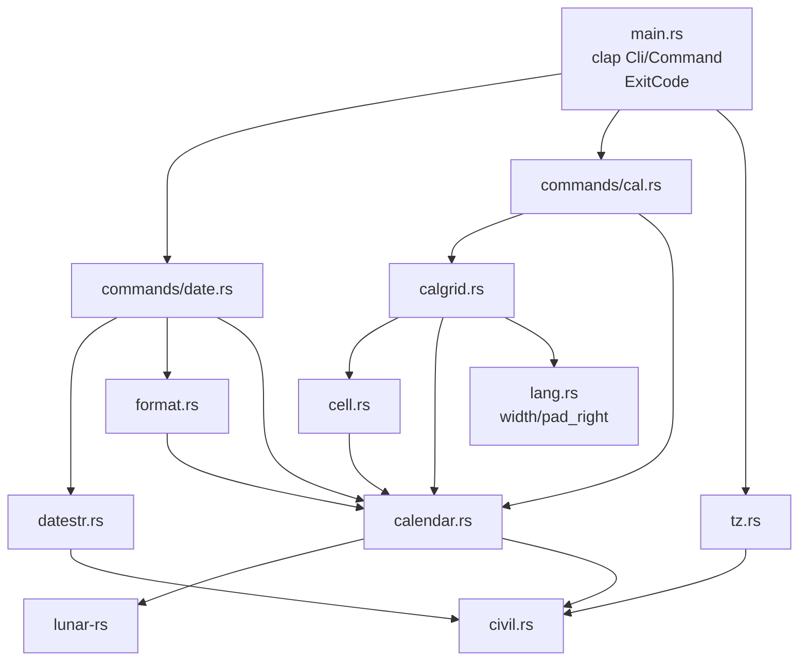

# Repository Guidelines

## Project Overview

`lunar` is a single-crate Rust CLI (binary `lunar`) that prints Chinese lunisolar-calendar
information. Two subcommands:

- `lunar date` — one day's almanac profile (公历 / 星期 / 农历 / 干支 / 生肖 / 节气), or a
  custom `-f` format.
- `lunar cal` — `cal`-style month/year grids overlaid with lunar days, the 24 solar terms
  and traditional festivals, over civil months or, with `-L`, lunar months.

All astronomy is delegated to the [`lunar-rs`](https://crates.io/crates/lunar-rs) crate (a
ShouXing / 寿星天文历 port). **This repo never implements calendar math itself** — it parses
input, shapes `lunar-rs` output, and renders grids. Supported range is civil years
**1–9999** (`MIN_YEAR`/`MAX_YEAR`, `src/calendar.rs:21,24`). Before writing any
calendar logic, read *Dependency First* below.

## Dependency First: Check `lunar-rs` Before Implementing

**All calendar computation belongs to `lunar-rs`.** This repo is a CLI shell
around it: argument parsing, output shaping, and grid layout. Before writing
any code that answers a calendar question, **search the engine for an existing
implementation and use it.** Do not reimplement what it already does — not the
astronomy, not the tables, not the date arithmetic.

This is not a formality. `Solar` exposes **144** public methods and `Lunar`
**305**, across roughly thirty calendar systems (Foto, Minguo, Dangi, Coptic,
Hijri, Julian, …), plus `solar_util`, `lunar_util`, `holiday_util` and the
ShouXing astronomy in `shou_xing/`. The odds that a question you are about to
answer by hand is already answered are high.

The upstream checkout is at `~/projects/lunar-rs` — read it directly. Do not
work from memory of the crate; the API is large and moves.

| To find | Look in |
|---|---|
| A date conversion or attribute | `src/solar.rs`, `src/lunar.rs` — `grep 'pub fn' ` |
| Name tables (weekday, month, day, ganzhi, zodiac) | `src/solar_util.rs`, `src/lunar_util/tables.rs` |
| Festival and term lookup | `src/festival.rs`, `src/lunar_util/maps.rs`, `src/solar_util.rs` |
| Other calendar systems | `src/<system>.rs`, all re-exported from `src/lib.rs` |
| The astronomy itself | `src/shou_xing/` |

Two consequences for this codebase:

1. **Add to `src/calendar.rs`, not to the command modules.** It is the single
   boundary to the engine; every wrapper in it is a one-line forward. A second
   path to `lunar-rs` is a design regression.
2. **When the engine has a quirk, adapt it — do not patch around it.** The
   wrappers exist precisely for that (`lunar_month_start` filters the
   lunar-new-year window, `solar()` maps `GregorianGap`). If you find yourself
   writing a table, a lookup, or arithmetic that the engine already owns, stop:
   you are duplicating work that is better fixed upstream.

**Counter-example to keep in mind:** 国庆节 was missing from every grid for the
life of this tool because the code consulted only `Lunar::festivals()`. The
civil festivals live in `Solar::festivals()`. The engine had them all along;
the mistake was not reading its API before using it.

## Architecture & Data Flow

There is **no `lib.rs`** — everything is binary-internal, declared in `src/main.rs:12-19`.
Each module has one job and the dependency direction is strictly one-way:



- `src/calendar.rs` — the **only** module that talks to `lunar-rs` for calendar answers.
  Owns `CalError`, `MIN_YEAR`/`MAX_YEAR`, and one-line wrappers (`lunar_month_name`,
  `jie_qi`, `year_gan_zhi`, `traditional_festivals`, …). Wrappers exist to *shape* output
  or to adapt an engine quirk, never to add logic of their own.
- `src/civil.rs` — proleptic-Gregorian epoch ↔ civil-date bridge (Hinnant's
  `days_from_civil`/`civil_from_days`) and `CivilDate` stepping. It exists because
  `lunar-rs`' `Solar` deliberately models the 1582 reform and rejects
  `1582-10-05..=1582-10-14`, which the `-d` parser and grid stepping must cross.
- `src/calgrid.rs` — grid layout: `Entry`/`Grid`, pitch constants, `render`.
- `src/cell.rs` — the cell-content **priority policy** (see below).
- `src/datestr.rs` — the `date(1)`-style `-d` parser.
- `src/format.rs` — the `-f` token engine.
- `src/commands/` — the two subcommand implementations.
- `src/lang.rs` — the display-width measurement the grid depends on.

**Data flow.** `main()` parses clap, resolves `today` once via `tz::today()`, builds one
`String` buffer, dispatches to `date::run` / `cal::run`, and writes the buffer to stdout in
a single `write_all` (`src/main.rs:186-196`). On `Err` it prints `lunar: {error}` to
stderr, returns `ExitCode::FAILURE`, and **discards the whole buffer** — so a mid-loop
failure in `cal` prints nothing to stdout.

Both commands share the same signature contract:

```rust
pub fn run(args: &XArgs, today: CivilDate, out: &mut String) -> Result<(), CalError>
```

**Consequence: command modules must never print.** They append to `out` and return an
error. This is what makes the integration tests possible.

`lunar-rs` quirk: `LunarYear::get_month`/`LunarMonth::get_first_day` walk the lunar-new-year
window and can return a day belonging to a *neighbouring* year. `calendar::lunar_month_start`,
`lunar_year_month` and `lunar_year_months` (`src/calendar.rs:232-262`) exist purely to
filter/fix that. Any new lunar-month lookup must go through them.

## Key Directories

| Path | Purpose |
|---|---|
| `src/` | 8 modules + `src/commands/`; ~2.1k lines total |
| `src/commands/` | `mod.rs`, `date.rs`, `cal.rs` — CLI surface only |
| `tests/` | exactly one integration-test file, `documented_examples.rs` |
| `target/` | build output, gitignored (`.gitignore` = `/target`) |

## Development Commands

```bash
cargo build --release        # release: lto=true, codegen-units=1, strip=true
cargo run -- cal 2026 9      # civil-month grid
cargo run -- cal -L 2026 7   # lunar-month grid
cargo run -- date -d 2026-09-07
cargo test                   # the integration suite
cargo fmt                    # required: `cargo fmt --check` is clean at HEAD
cargo clippy --all-targets   # required: zero warnings at HEAD
```

There is **no CI, no Makefile/justfile, no `rust-toolchain.toml`, no `rustfmt.toml`, no
`[lints]` block and no dev-dependencies.** The lint/format gate is whatever you run
locally; keep both clean. `Cargo.lock` is tracked; `target/` is not.

## Code Conventions & Common Patterns

**Comment / language policy (strictly mixed).**

- Module, function and struct doc-comments are **English prose**; every `pub` item carries
  one. Do not add Chinese prose to doc-comments.
- **All user-facing strings are Chinese**, including error messages, grid titles, cell
  labels and the clap `///` help on the subcommand variants (`src/main.rs:51-115`).
- Error `Display` strings are Chinese and full-width-punctuated (`src/calendar.rs:50-76`).
  `tests/documented_examples.rs` substring-matches these strings, so **changing an error
  message is a breaking change for the suite**.

**Formatting.** Plain `rustfmt` defaults, no config file. One import per line, no glob
imports, imports grouped std / external / `crate::` separated by blank lines.

**Error handling.** One error type, `CalError` (`src/calendar.rs:28-48`), with a hand-written
Chinese `Display` and `impl std::error::Error`. Every fallible path returns
`Result<_, CalError>`; no `unwrap`/`expect` in `src/` (they appear only in `tests/`).
Helper constructors: `check_year` / `check_month` / `check_day` / `solar`.

**Output rendering.** Build into `&mut String` via `std::fmt::Write`
(`let _ = write!(out, …)`), never `println!`, except the `--help-format` short-circuit
(`src/main.rs:137`). Note the deliberate `let _ =` on `write!` — a `String` cannot fail, so
the result is ignored rather than propagated.

**Dependency injection / state.** There is no DI framework and no global state. The two
injection points are the explicit `today: CivilDate` parameter (making every command
deterministic and testable) and the `CellStyle` value struct, which is the single
configuration seam into the rendering policy. Flags are mapped to `CellStyle` in exactly
one place, `cal::run` (`src/commands/cal.rs:49-53`); keep it that way.

**Cell priority is policy, not configuration.** `cell::content` (`src/cell.rs:48-63`) is the
single source of truth, in this order:

```text
节日 > 初一显示月份名 > 节气 > 农历日
```

The month-name level is skipped on 正月 (so 春节 keeps its festival label), and
`--number` only affects the final 农历日 level, never the priority. Do not reorder or
reimplement this outside `cell.rs`.

**Both calendars' festivals are consulted.** `calendar::traditional_festivals`
takes *both* a `Solar` and a `Lunar` and chains `Solar::festivals()` (civil:
国庆节, 劳动节, plus the weekday-floating ones) with `Lunar::festivals()`
(lunar: 春节, 中秋节). Consulting only the `Lunar` half silently drops every
civil festival — an October grid read `廿一` where 国庆节 belongs. When a day
carries several, `festival_rank` prefers the one a reader scans for.

**Leap months are negative numbers.** A leap fourth month is `-4`; `m_abs`
(`src/calendar.rs:81-85`) renders the 闰 prefix. Keep the sign convention.

**Grid width is a display width, measured by `lang::width`.** CJK ideographs and
full-width forms count 2 columns, everything else 1. Padding is manual
(`lang::pad_right`), not `{:>width$}`, because Rust's format width counts
*characters* and would misalign every CJK cell. The column width is the widest
label or content the grid holds — there is no cap and no truncation, since the
longest Chinese cell (`中秋节`, `闰四月`) is 6 columns — and every row of a grid
shares it, because per-row auto-fit would misalign the columns.

**Keep `GUTTER`.** A cell that exactly fills its column leaves no space
before its neighbour, and the narrow grids hit this: 闰四月 has no festival, so
its column is 4 columns for `5/23`, and with no gutter the row renders
`5/235/245/27`. It is easy to miss because the months that *do* carry a
6-column festival are wide enough to hide the defect.
`cells_never_run_together` pins it.

**One language: Simplified Chinese.** There is no language selection and no
translation table. Every user-facing string is Chinese, and names the engine
owns — weekdays, ganzhi, solar terms, festivals, month and day names — are used
as `lunar-rs` supplies them. `src/lang.rs` holds only the width measurement and
`pad_right`; it has no `Terms`, no `Language`, and reads no environment
variable. **Do not reintroduce a language layer without being asked**: it is
the change that made the grid layout (column width, truncation) hardest.

**No async.** Entirely synchronous; there is nothing to await.

## Important Files

| File | Role |
|---|---|
| `src/main.rs` | clap `Cli`/`Command` derive, `FORMAT_HELP`, dispatch, exit codes |
| `src/calendar.rs` | `CalError`, year range, all `lunar-rs` shaping |
| `src/civil.rs` | `CivilDate`, epoch math, reform-gap workarounds |
| `src/calgrid.rs` | `Grid::lunar` / `Grid::civil_blanked` / `Grid::render` |
| `src/cell.rs` | cell priority + `CellStyle` |
| `src/datestr.rs` | `-d` grammar |
| `src/format.rs` | `-f` token table |
| `src/lang.rs` | `width`, `pad_right` |
| `src/commands/{date,cal}.rs` | subcommand logic |
| `tests/documented_examples.rs` | the entire test suite |
| `Cargo.toml` | 19 lines; no workspace, no lints, no dev-deps |

**Adding a `-f` token:** extend the `match` in `format.rs` **and** both user-facing
tables — the `FORMAT_HELP` string (`src/main.rs:30-38`) and the README table
(`README.md:74-89`). The token table is duplicated in three places by design (help text,
README, module doc `src/format.rs:5-19`); all three must stay in sync.

**Adding a `-d` form:** extend `datestr::parse`'s precedence chain (`src/datestr.rs:53-73`).
Order matters and is first-match-wins: keyword → `@epoch` → absolute → weekday →
relative. Add a unit to `apply_unit` (`src/datestr.rs:339-352`), which currently knows
fortnight/day/week/month/year and treats sub-day units as a **no-op**.

## Runtime/Tooling Preferences

- **Rust 2024 edition** (`Cargo.toml:4`) — `edition = "2024"`, so let-chains
  (`if cond && let Some(x) = …`, used at `src/cell.rs:49`) are available.
- Toolchain is the **distro `rust` package** (1.98.1 at time of writing), not rustup.
  There is no pinned `rust-toolchain.toml`; do not add one or install a second toolchain.
- Package manager is **cargo** with the user's `~/.cargo/config.toml` crates.io mirror.
  Use `cargo` directly; no wrapper, no workspace.
- `Cargo.lock` is committed — commit it alongside any dependency change.
- The dependency `tz` is a **rename** of `tz-rs` (`Cargo.toml:14`); in code it is
  `use tz::{…}`. The other direct deps are `clap` (derive feature) and `lunar-rs`
  (the `i18n` feature supplies the Chinese name tables).

## Testing & QA

**One test file, one mechanism.** `tests/documented_examples.rs` is the whole
suite. There are **no `#[cfg(test)]` unit tests in `src/`** and no mocking,
fixtures, or snapshot framework. Every test spawns the real binary:

```rust
fn binary() -> Command                 // the compiled binary
fn run(args: &[&str]) -> String        // asserts success, trims trailing '\n'
fn run_failing(args: &[&str]) -> String // asserts failure, returns stderr
```

**No locale is set.** The tool speaks Simplified Chinese unconditionally, so
tests spawn the binary with an inherited environment and compare its output
directly.

**How to write a new test.** Add a `#[test]` using `run` / `run_failing`
and compare exact output. Three tests pin whole grids byte-for-byte via raw-string
literals; the rest use `contains`, line-count or column-index probes. **Copy
expected grid text from real binary output** — never hand-compute the padding,
because it is measured in display columns. The column width is per-grid: it is
the widest cell the month happens to hold, so two months of the same year pad
differently.

**What the suite pins:** the `date` profile lines, the whole `-f` token table, the civil and
lunar grid layouts, `--number` / `--no-month-name` / `--no-festival`, `-s` column shifting,
`-R` leap-month gating, bare-year and month-span behaviour, the year-range and reform-gap
error messages, both calendars' festivals (国庆节 as well as 中秋节), and —
separately — calendar values **by date** (芒种 on 2020-06-05, …).

**Engine wins over samples.** Where the published samples and the astronomy disagree, the
engine is correct and the sample is stale. The suite says so explicitly at
`tests/documented_examples.rs:1-5`, and `README.md:199-201` repeats it. Stale cells include
中元 three days early, 芒种 on the wrong day, and 雨水/惊蛰 missing. **Do not "fix" the
engine to match a sample.**

**Beyond pinning layouts, the suite pins an invariant** a renderer can easily
break: that every month of the year shows every one of its days, in order
(`civil_grid_shows_every_day_of_the_month`).

**Coverage gaps to be aware of when editing `src/datestr.rs`:** the epoch, keyword, relative,
weekday and zone code paths have **no** coverage at all — the suite only exercises plain ISO
`-d` values. A change there needs a new test you add yourself.

## Known Defects (verified, not yet fixed)

Do not treat these as intended behaviour, and do not "fix" them silently as a side effect
of unrelated work — surface them, or fix them deliberately with a test.

- **Any grid spanning 1582-10-05..14 fails outright.** `CivilDate::add_days` is proleptic
  but each slot is validated with `to_solar()`, so a month whose slot window crosses the
  reform gap dies with the `YearMissing` message. Verified: `cal 1582 10` errors, while
  `cal 1582 9` and `cal 1582 11` render fine.
- `CalError::TodayOutOfRange` overloads four unrelated failures — an unparsable `TZ`, a
  missing `/etc/localtime`, a clock before 1970, and a local year outside 1–9999
  (`src/tz.rs:19,21,33,36`; `src/calendar.rs:120`) — all printing
  `当前日期超出支持范围 (1–9999 年)`. Verified: `TZ=Asia/Shangahi lunar date` reports a
  date-range problem, not a bad zone.
- **`-d` rejects numeric zone offsets.** `split_zone` returns a slice starting one byte
  *before* the sign (`&rest[index - 1..]`, `src/datestr.rs:219`), so `zone_offset`'s
  `bytes.first()` never sees `+`/`-` and returns `None`. `2026-09-07T15:30+08:00` fails,
  contradicting `README.md:55`. Only `Z`/`UTC`/`GMT` suffixes work — and they all offset by
  zero, so they can never change the day.
- **`-d` rejects `next month` / `next week` / `last year`** — advertised at `README.md:57`
  and `src/datestr.rs:292`. `apply_unit` has no `next`/`last` arm, so the bare word hits the
  error arm. (`next friday` works, because `parse_weekday` runs first.)
- **`MM/DD/YYYY` is unreachable.** The short-year branch (`src/datestr.rs:118-136`) matches
  any 1–3-digit-leading `/`-separated triple first, so `09/07/2026` parses as year 9 and
  then fails validation. `README.md:56` advertises this form.
- `20260907T1530` (`src/datestr.rs:8`) and a bare `2026-09-07Z` both fail — `parse_clock`
  has no compact `HHMM` form and returns `None` for an empty clock.
- Sub-day relative units (`90 minutes ago`, `2 hours`) are accepted but are **no-ops**
  (`src/datestr.rs:347-348`).
- `src/format.rs:20-21` no longer claims `\%` yields a literal `%`; the code emits `\%`
  (two chars). Use `%%`. `\r` works but is still undocumented.
- The same bad date yields different messages depending on the input channel: `2023-02-30`
  is `无法解析的日期: 2023-02-30` via `-d` but `公历 2023-02-30 不存在` via positional
  `年 月 日`; out-of-range components give `月份 13 非法 (应为 1–12)` /
  `日期 32 非法 (应为 1–31)` positionally but collapse to `无法解析的日期` via `-d`.
  The 1582-10-05..14 gap is the one case that reports its own message
  (`1582 年 10 月 5 日至 14 日不存在…`) on **both** channels.
- `cal` uses `CalError::MonthOutOfRange { month: -1 }` as a generic "bad argument" sentinel
  (`src/commands/cal.rs`), producing the misleading `月份 -1 非法 (应为 1–12)`.
- `-3` / `-n N` are silently ignored under `-L` whenever a positional is present.
- `src/main.rs` parses `-m/--monday` and discards it; Monday is hard-coded. The README
  options table implies otherwise.
